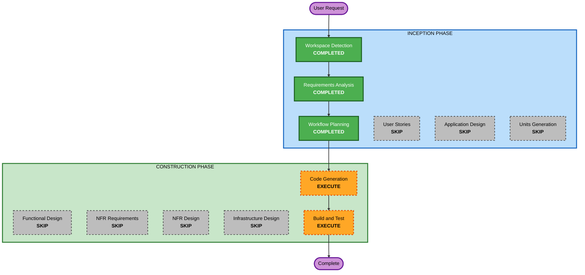

# Execution Plan - 家計簿Webアプリ

## Detailed Analysis Summary

### Change Impact Assessment
- **User-facing changes**: Yes — 新規Webアプリケーション全体を構築
- **Structural changes**: Yes — Next.js プロジェクト新規作成
- **Data model changes**: Yes — SQLiteスキーマの新規設計（取引、カテゴリ）
- **API changes**: Yes — CRUD API エンドポイント新規作成
- **NFR impact**: Low — ローカル開発のみ、認証なし

### Risk Assessment
- **Risk Level**: Low
- **Rollback Complexity**: Easy（グリーンフィールド、既存コードへの影響なし）
- **Testing Complexity**: Simple（CRUD操作、単一ユーザー）

---

## Workflow Visualization



### Text Alternative
```
Phase 1: INCEPTION
- Workspace Detection    (COMPLETED)
- Requirements Analysis  (COMPLETED)
- Workflow Planning      (COMPLETED)
- User Stories           (SKIP)
- Application Design     (SKIP)
- Units Generation       (SKIP)

Phase 2: CONSTRUCTION
- Functional Design      (SKIP)
- NFR Requirements       (SKIP)
- NFR Design             (SKIP)
- Infrastructure Design  (SKIP)
- Code Generation        (EXECUTE) <-- Next
- Build and Test         (EXECUTE)

Phase 3: OPERATIONS
- Operations             (PLACEHOLDER)
```

---

## Phases to Execute

### INCEPTION PHASE
- [x] Workspace Detection (COMPLETED)
- [x] Requirements Analysis (COMPLETED)
- [x] Workflow Planning (COMPLETED)
- [x] User Stories — SKIP
  - **理由**: シングルユーザー、ミニマム機能、ペルソナ分析不要
- [x] Application Design — SKIP
  - **理由**: シンプルなCRUDアプリ、Next.jsの標準構成で十分、新規コンポーネント設計不要
- [x] Units Generation — SKIP
  - **理由**: 単一のNext.jsアプリ、分割不要

### CONSTRUCTION PHASE
- [x] Functional Design — SKIP
  - **理由**: データモデルが単純（取引テーブル + カテゴリテーブル）、要件で十分定義済み
- [x] NFR Requirements — SKIP
  - **理由**: 技術スタック確定済み、ローカル開発のみ、該当するセキュリティルールはコード生成時に直接適用
- [x] NFR Design — SKIP
  - **理由**: NFR Requirements をスキップしたため
- [x] Infrastructure Design — SKIP
  - **理由**: ローカル開発のみ、インフラ設計不要
- [ ] Code Generation — EXECUTE
  - **理由**: アプリケーションコードの実装が必要（常時実行）
- [ ] Build and Test — EXECUTE
  - **理由**: ビルド・テストの実行が必要（常時実行）

---

## Security Extension Compliance Plan

セキュリティルールの適用判定（コード生成時に適用）：

| Rule | Status | 理由 |
|---|---|---|
| SECURITY-01 | N/A | ローカルSQLite、ネットワーク通信なし |
| SECURITY-02 | N/A | ネットワーク中間者なし |
| SECURITY-03 | Applicable | 構造化ログ必要 |
| SECURITY-04 | Applicable | HTTP セキュリティヘッダー設定 |
| SECURITY-05 | Applicable | API入力バリデーション |
| SECURITY-06 | N/A | IAMポリシーなし |
| SECURITY-07 | N/A | ローカル開発のみ |
| SECURITY-08 | N/A | 認証なし |
| SECURITY-09 | Applicable | エラーハンドリング、本番エラー非公開 |
| SECURITY-10 | Applicable | 依存関係管理、ロックファイル |
| SECURITY-11 | Applicable | セキュリティ分離、レート制限（ローカルでは簡易） |
| SECURITY-12 | N/A | 認証なし |
| SECURITY-13 | Applicable | SRI、安全なデシリアライゼーション |
| SECURITY-14 | N/A | ローカル開発のみ |
| SECURITY-15 | Applicable | 例外ハンドリング、フェイルセーフ |

---

## Success Criteria
- **Primary Goal**: 収入・支出の記録とカテゴリ分類ができる家計簿Webアプリの完成
- **Key Deliverables**:
  - Next.js (TypeScript) アプリケーション
  - SQLite データベース（Prisma ORM）
  - CRUD API（取引、カテゴリ）
  - フィルタリング機能付き一覧画面
  - テストコード
- **Quality Gates**:
  - 全テスト通過
  - 入力バリデーション実装
  - 適用可能なセキュリティルール準拠
